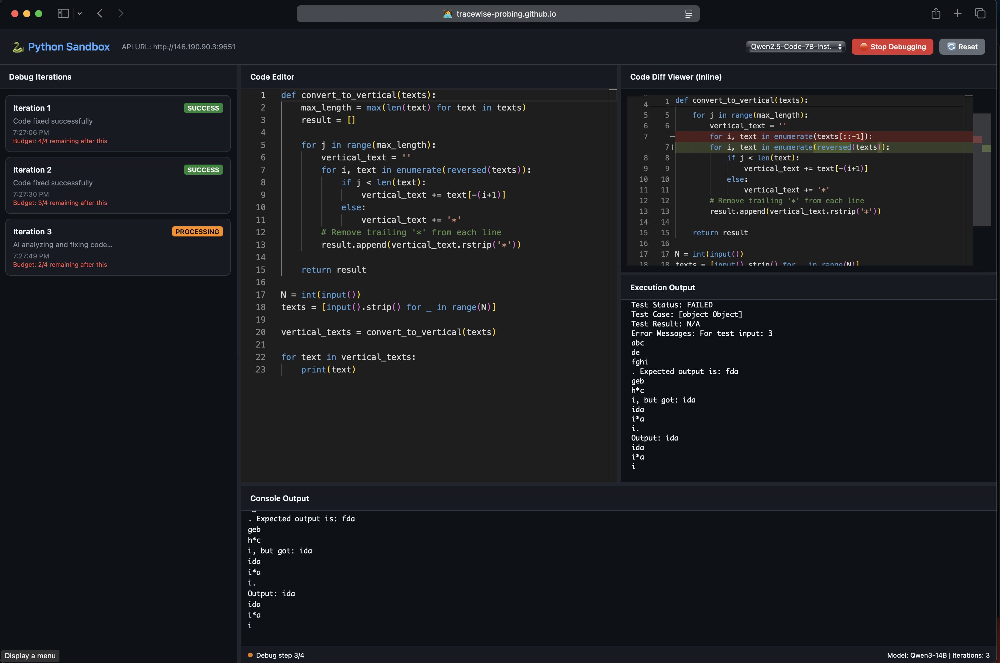

# `SemEnhance(🔍) => 🚀`

<p align="center">
    <a href="#"></a>
    <a href="#"></a>
    <a href="#"></a>
    <a href="#"></a>
    <a href="#" title="Docker"></a>
</p>

<p align="center">
   <a href="https://tracewise-probing.github.io/python_sandbox.html">🐍 Playground</a> •
   <a href="https://tracewise-probing.github.io/leaderboard.html">🏆 Leaderboard</a> •
   <a href="#-quick-start">⚡ Quick Start</a> •
   <a href="#-framework-components">🧩 Framework Components</a> •
   <a href="#-installation--setup">⚙️ Installation</a> •
   <a href="#-citation">📝 Citation</a> •
   <a href="#-acknowledgement">💝 Acknowledgement</a>
</p>



This screenshot shows a Python debugging environment with multiple iterations of a text-to-vertical conversion function that's currently failing its test case.

## 📢 News

Who's using SemEnhance framework? SemEnhance has been adopted by various research teams and organizations:

* Code LLM researchers exploring semantic understanding
* Programming education platforms integrating execution traces
* Software engineering teams building trace-aware development tools
* Open-source projects focusing on program comprehension

Below tracks the notable updates of SemEnhance:

- **[2025-06-01 `v1.0.0`]**: SemEnhance framework officially released! Highlights: *(i)* Generic framework for semantic information integration, *(ii)* Comprehensive evaluation across multiple code tasks, *(iii)* Support for various trace representations and LLM backends.
- **[2025-01-15 pre `v1.0.0`]**: The paper is ready.

<details><summary>Earlier news <i>:: click to expand ::</i></summary>
<div>

- **[2024-10-01]**: Initial framework development with support for execution trace integration
- **[2024-09-15]**: Dataset construction pipeline completed with trace-rich data generation
- **[2024-09-01]**: Comprehensive study design for semantic information effectiveness

</div>
</details>

## 📙 About

SemEnhance is a comprehensive framework for enhancing Code LLMs with semantic information, featuring:

- ✨ **Trace Integration**: Systematic integration of execution traces into code prompts
- ✨ **Generic Framework**: Supports multiple semantic representations and LLM backends
- ✨ **Comprehensive Evaluation**: Rigorous assessment across various code generation tasks
- ✨ **Surprising Findings**: Reveals limited impact of semantic information on SFT, challenging previous assumptions

Why SemEnhance?

- 🔬 **Systematic Approach**: First generic framework supporting different types of code semantic representations
- 📊 **Empirical Insights**: Comprehensive study revealing the true effectiveness of semantic information in Code LLMs
- 🚀 **Test-Time Scaling**: Demonstrates significant improvements (up to 10.85%) when combined with test-time scaling
- 🌐 **Open Source**: High-quality dataset and implementation publicly available for reproducibility

Want to know more details? Read our papers & materials!

- **SemEnhance**: [EMNLP'25 paper](#), [Slides](#), [Poster](#), [Dataset](https://github.com/tracewise-probing/tracewise_probing)

## 🔥 Quick Start

### Prerequisites

```bash
# Install LLaMA-Factory (required dependency)
pip install --upgrade llamafactory
# Or install from source: pip install "llamafactory @ git+https://github.com/hiyouga/LLaMA-Factory"

# Clone this repository
git clone https://github.com/tracewise-probing/tracewise_probing.git
cd tracewise_probing

# Install SemEnhance
pip install -e .
```

### Semantic-Enhanced Code Generation

```bash
## Note, This wrapped command will change in future, it is unstable, please use directly from folder: finetune_src/LLaMA-Factory
# Basic usage - Full trace enhancement
semenhance.finetune --model "deepseek-ai/deepseek-coder-6.7b-base" \
                    --dataset trace_corpus \
                    --trace-type execution \
                    --method full-trace

# LoRA fine-tuning for efficient training
semenhance.finetune --model "google/codegemma-2b" \
                    --dataset trace_corpus \
                    --trace-type execution \
                    --method full-trace \
                    --lora-rank 64

# Baseline training without traces
semenhance.finetune --model "meta-llama/Llama-3.1-8B" \
                    --dataset trace_corpus \
                    --trace-type none \
                    --method baseline

# List all available configurations
semenhance.finetune --list-configs

# Dry run to preview the command
semenhance.finetune --model "deepseek-ai/deepseek-coder-6.7b-base" \
                    --dataset trace_corpus \
                    --trace-type execution \
                    --method full-trace \
                    --dry-run
```

<details><summary>🛡️ Safe execution with Docker <i>:: click to expand ::</i></summary>
<div>

```bash
# Build and run with Docker
docker build -t semenhance .
docker run -it --gpus all semenhance

# Local generation with traces
cd construct_dataset
python generate_traces.py --dataset mbpp --output traces/
```

</div>
</details>

### Test-Time Scaling with Semantic Information

```bash
cd skythought__test-time-scaling

# Enhanced inference with test-time scaling
export trace_name=bug_trace_TPL_NEXT 
export difficulty=medium
export MAX_ROUND=3

python evaluate_multiprocess.py \
  --difficulty=${difficulty} \
  --temperature=0.7 \
  --num_threads=16 \
  --n=8 \
  --selection=oracle \
  --lcb_version=release_v4 \
  --start_date=2024-08-01 \
  --end_date=2024-12-01 \
  --num_round=${MAX_ROUND} \
  --api_name=hosted_vllm/Qwen/Qwen2.5-Coder-7B-Instruct \
  --api_base=http://127.0.0.1:8001/v1 \
  --selection=oracle_all_rounds \
  --result_json_path="results_sky_v2/sec5_${trace_name}_revision_vanilla_qwen_7b_${difficulty}_max_round_${MAX_ROUND}.json"
```

## 🚀 Framework Components

### Dataset Construction

Build trace-rich datasets for semantic enhancement:

- **Trace-Rich Data Generation**: Automated pipeline for generating execution traces
- **Multi-Modal Representations**: Support for various semantic information types
- **Quality Assurance**: Comprehensive validation and filtering mechanisms

```bash
# Construct dataset with execution traces
cd construct_dataset
python build_dataset.py --source mbpp --trace-types execution,static --output data/enhanced/
```

### Fine-Tuning with Semantic Information

Train models with integrated semantic information:

- **Parameter-Efficient Fine-Tuning**: LoRA, QLoRA, and full fine-tuning support
- **Trace Integration**: Systematic integration of semantic information into prompts
- **Multiple Backends**: Support for various LLM architectures

```bash
# Direct LLaMA-Factory usage for advanced configurations
cd LLaMA-Factory
llamafactory-cli train examples/train/rq1_overview_codegemma/rq1_full_rq1_notrace_baseline.yaml
```

### Inference with Semantic Enhancement

Perform enhanced inference with semantic information:

- **Test-Time Scaling**: Enhanced reasoning through multiple inference passes
- **Trace-Aware Prompting**: Dynamic integration of execution traces during inference
- **Performance Optimization**: Efficient implementation for large-scale evaluation

```bash
# Run inference with trace-based enhancement
cd skythought__test-time-scaling
bash scripts/sec4_parallel_sample/vanilla_qwen_7b.sh
```

## 📊 Key Findings

Our comprehensive study reveals several surprising insights:

### Limited Impact on Supervised Fine-Tuning
- Semantic information (execution traces) shows **minimal improvement** during SFT
- Contradicts previous research findings about trace-based enhancement
- Suggests that static semantic integration may not be the optimal approach

### Significant Improvement with Test-Time Scaling
- **Up to 10.85% performance boost** when combined with test-time scaling
- Demonstrates the importance of dynamic reasoning during inference
- Highlights the potential of semantic information in multi-step reasoning

### Framework Generalizability
- Supports multiple semantic representations and LLM backends
- Provides systematic approach to semantic enhancement research
- Enables reproducible evaluation across different configurations

## 🔧 Installation & Setup

<details><summary>Complete installation guide <i>:: click to expand ::</i></summary>
<div>

```bash
# Method 1: Install from PyPI (when available)
pip install semenhance

# Method 2: Install from source (recommended for development)
git clone https://github.com/tracewise-probing/tracewise_probing.git
cd tracewise_probing
pip install -e .

# Method 3: Install with all dependencies
pip install "semenhance[all]"

# Install system dependencies
sudo apt-get update
sudo apt-get install -y python3-dev build-essential

# For GPU support
pip install torch torchvision torchaudio --index-url https://download.pytorch.org/whl/cu118
```

### Requirements
- Python 3.8+
- PyTorch 1.12+
- CUDA 11.8+ (for GPU acceleration)
- LLaMA-Factory

</div>
</details>

## 🤝 Contributing

We welcome contributions to improve the SemEnhance framework! Please check our [contribution guidelines](CONTRIBUTING.md) and feel free to submit issues and pull requests.

### Development Setup
```bash
git clone https://github.com/tracewise-probing/tracewise_probing.git
cd tracewise_probing
pip install -e ".[dev]"
pre-commit install
```

## 📜 Citation

```bibtex
@inproceedings{semenhance2025,
  title = {SemEnhance: A Comprehensive Framework for Code LLM Semantic Enhancement with Execution Traces},
  author = {[Authors]},
  year = {2025},
  url = {https://github.com/tracewise-probing/tracewise_probing},
}
```

## 🙏 Acknowledgement

- [HumanEval](https://github.com/openai/human-eval) and [MBPP](https://github.com/google-research/google-research/tree/master/mbpp) for foundational benchmarks
- [EvalPlus](https://github.com/evalplus/evalplus) for rigorous evaluation framework
- [LlamaFactory](https://github.com/hiyouga/LLaMA-Factory) for efficient fine-tuning infrastructure
- The open-source community for continuous support and contributions

## 📄 License

This project is licensed under the Apache License 2.0. See [LICENSE](LICENSE) for details.

---

<p align="center">
    <i>SemEnhance: Advancing Code LLMs through Semantic Understanding</i>
</p>
